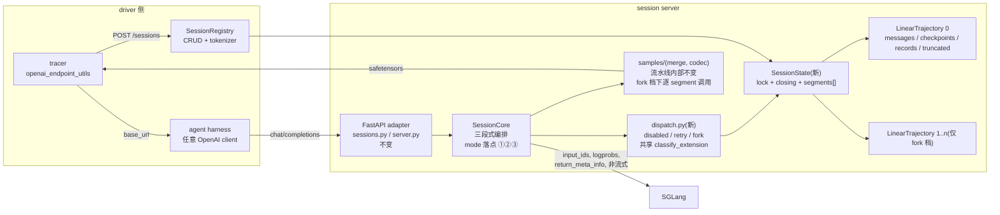
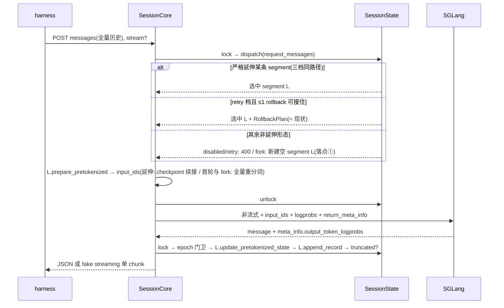

# Session Server Rollback 模式设计:disabled / retry / fork 单轴,fork 即多 segment

状态:设计草案待评审(2026-07-22,v3:模式轴重构——`--session-rollback-mode {disabled, retry, fork}` 单旋钮取代 v2 的 `linear/auto` 双值轴;v3.1:首轮独立评审后修订——红基线 M0 前置、HTTP 级 rollback pin tests 先钉后拆、fork 占位(seed)语义、`truncated` 派生化;v3.2:上游 #1759 简化 codec 收编红基线问题,M0 作废,基线重建于各 PR 最新 heads 并实测全绿)。评审者需要决定的问题:(1) 单旋钮取代双轴的轴设计;(2) 四个已选定裁决——retry 模式下 divergent 续接沿用今天的 ≤1 rollback(保真锚定)、fork 零继承直接 retokenize、截断 409 仅 fork 模式、数据面形状按模式分支。

需求方已裁定、不再是评审问题:三值语义按"输入与历史的形状"划分(严格延伸之外,pure-drop 与 divergent 的处置矩阵见语义总表);fork 模式无破坏性 rollback(非延伸形态一律开新 segment);message 匹配过程 per session 并发度必须为 1(由 session lock 保证,见 I3)。

前置依赖:本设计基于 PR #1758/#1759/#1760(sample 装配下沉到 session server)与 PR #1762(fake streaming)之后的代码形态。`TRUNCATION_HANDLING_DESIGN.md` 已废弃,其替代方向(截断即终点)在本文 fork 模式下正式化;`FAKE_STREAMING_DESIGN.md` 非目标清单中的"trajectory 层多 segment 方向备忘"即本文。

## 动机与决策点

session server 的使用者对"请求与存储历史不匹配"的期望分三档,今天只实现了中间档:

- **disabled(新增,最严白盒)**:历史由用户全权掌控,任何非严格延伸都是 harness bug,应当立即 400。今天做不到:rollback 无法关闭。
- **retry(现状)**:允许 harness 主动抛弃最近一个 assistant 重试(≤1 步破坏性 rollback),更深的回退与乱序历史 400。这是今天的唯一行为,也是保真锚点。
- **fork(新增,agentic)**:Claude Code 类 harness 会派生 subagent、重放分叉历史,向**同一个** session URL 提交多条线性对话。今天确定性失败:
  - fact:subagent 首请求携带自己的 system prompt,零重叠,`_try_detect_and_rollback_to_assistant_checkpoint` 在 matched prefix 中找不到 assistant → 400([linear_trajectory.py:205-210](miles/rollout/session/linear_trajectory.py#L205-L210));
  - fact:跨多个 assistant 的深回退被 `MAX_ASSISTANT_ROLLBACK_STEPS = 1` 拒绝([linear_trajectory.py:17](miles/rollout/session/linear_trajectory.py#L17));
  - fact:`collect_samples` 的 TODO 点名本缺口:"splitting (compaction/subagent) is a separate message-level operation, not built yet"([core.py:217-218](miles/rollout/session/core.py#L217-L218))。

三档的产品权重并不均等(需求方裁定,v3):**严格线性的 harness 在现实中几乎不存在**——一个只会严格 append 历史的 harness 等价于纯 tool call 执行层,没有 memory 操作、历史编辑、subagent 派生;真实 harness(Claude Code 类)天然带这些行为。因此"是否允许多 segment"不是值得独立抽象的产品维度(v2 的 `linear/auto` 轴据此废除,见方案选择),`fork` 是面向目标场景的主线档;`disabled`/`retry` 的存在价值是现状保真、白盒调试与退化执行层场景,而非目标产品形态。

成功图景:一个旋钮三档。默认 `retry` 下所有现有部署零感知;`disabled` 给白盒用户更强的 fail-loud;`fork` 下每条不能延伸既有 segment 的请求开一条新 segment,各自 TITO 追踪、各自装配为一个训练 Sample,`collect_samples` 返回 n 个 Sample,驱动侧现有 multi-sample 路径原样消化,任何 token 不被重复训练。

## 约束

硬约束(违反即方案不成立):

1. **retry 模式行为保真(desired requirement,需求方指令)**:retry 即现状——错误码与文案、wire 形状、恒单 Sample 装配与 422 语义、≤1 rollback 的触发条件全部不变。证明方式:存量测试在默认模式下**零修改**全绿。
2. **单 session URL(fact)**:每个 rollout sample 绑定一个固定 session id 的 URL,harness 无法新建 session;分叉必须在 session 内部表达。
3. **OpenAI 方言、任意 client(fact)**:无法要求 harness 携带 segment id、mode 标记等自定义字段;segment 归属只能从 `messages` 内容推断,mode 只能由 miles 侧配置。
4. **TITO 不变量(fact)**:每条 segment 的训练 token 必须是原始采样 id;`input_ids` 预分词注入、checkpoint 前缀校验、accumulated 对齐断言按 segment 独立成立。
5. **训练恰好一次(desired requirement)**:同一段采样 token 只出现在一个 Sample 的 loss 区;fork 的继承段必须落在子 segment 的 prompt 区(loss 天然为 0),不允许把旧 records 拷贝进新 segment 重复装配。
6. **截断即终点(decision,fork 模式)**:fork 模式下对截断 segment 尾部的延伸请求 fail-loud 拒绝。disabled/retry 不引入此行为(约束 1;今天的行为是延伸照旧、装配期 `merge_samples` 停在截断 turn)。
7. **匹配串行、生成并行(需求方裁定 + fact)**:message 匹配(分派)per session 并发度为 1——分派与状态变更全部在 session lock 内;Phase 2(无锁 proxy)保留并行度,并发 subagent 的后端调用同时在飞。

可交易偏好:三档共享的机制代码最大化(classify、TITO、装配流水线),mode 分支收敛到可枚举的落点。

## 非目标

- Anthropic 方言 adapter(独立设计轮)。
- compaction 历史管理(正常 RL loop 只出现 subagent)。
- per-session 的 mode 覆写(接口上是自然扩展点,v1 无需求)。
- 跨 segment 的 rollout 级 token 总预算(v1 只有 per-segment `max_seq_len`)。

## 方案选择

### 轴设计:单旋钮取代双轴(v3 的核心变更)

v2 曾设计两个维度:`--session-trajectory-mode linear/auto`(segment 多寡)+ 固定的 ≤1 rollback。把 rollback 政策独立成轴后发现两条独立的收敛理由:

- **结构上**:linear 与 auto 的全部分歧恰好就是"非严格延伸请求的处置",而这正是 rollback 政策的定义域。两轴不正交(fork 处置蕴含多 segment,disabled/retry 蕴含单 segment),组合出非法项(linear×fork)与冗余项。
- **产品上(需求方裁定)**:严格线性的 harness 几乎不存在——只有"纯 tool call 执行层"式的 harness 才严格线性,真实 harness 都带 subagent 与 memory/历史操作。"segment 多寡"因此不构成独立的产品维度;真正的维度只有一个,就是**对非延伸请求的容忍度**,即本旋钮。

故收敛为单旋钮:

- `--session-rollback-mode {disabled, retry, fork}`(以 `session` 前缀避免与训练侧 args 撞名;短名 `--rollback-mode` 亦可,评审定)。
- **disabled**:单 segment;任何非严格延伸 → 400。
- **retry**:单 segment;= 现状逐字节(≤1 破坏性 rollback,harness 主动抛弃旧 assistant 的语义;其余 400)。**默认值**。
- **fork**:多 segment;任何非严格延伸 → 开新 segment 继续 rollout,**无破坏性 rollback**(旧 segment 完整保留并正常出 Sample)。

v2 的 auto(subagent fork + 保留 ≤1 破坏性 rollback 的混合体)不再是独立档位;若 fork 模式实测暴露问题(见风险),可作为第 4 档回归,不影响本轴设计。

### fork 档的机制

比较尺:在约束 2-7 下,让非延伸请求被正确追踪并产出可训练 Sample 的最小机制。

- **备选 0:不改**。subagent 请求 400,harness 只能禁用 Task 工具。放弃场景,仅作基线。
- **备选 A:无匹配请求做无状态透传(不记录)**。不产训练数据且后续轮次持续 400。拒绝。
- **备选 B(选定):session 内 `list[LinearTrajectory]` + message 级延伸匹配 + fork 新建空 segment**。每个请求对每条 segment 做严格延伸判定(`message_matches`,dict 相等短路,线性扫描,k ≤ 64——前轮已裁决不建路由树);能延伸就路由过去,否则 fork。subagent 根、同型 sibling、pure-drop 重试、divergent 分叉全部收敛为同一个 fork 形态,连 rollback 分类都不需要。
- **备选 D:ProRL 式离线 token 前缀链重组**。与在线 TITO 架构逆行,拒绝。

(v1/v2 的备选 C"fork 全面取代 rollback"即 fork 档本身——需求方已裁定采纳;其"被放弃尾部要不要训练"的争议转为 fork 档的开放问题。)

### 四个裁决

1. **retry 档下 divergent 续接沿用今天的 rollback(保真锚定)**:今天的 rollback 同时接受 pure-drop(输入 `(A,B)` 对历史 `(A,B,C)`)与 divergent 续接(输入 `(A,B,D)`,即回退后接新内容——[linear_trajectory.py:157-175](miles/rollout/session/linear_trajectory.py#L157-L175) docstring 的 `tool₁_different` 例子就是它),都以 ≤1 assistant 为界。约束 1 要求 retry = 现状,故 **retry 档两种形状都保持今天的行为**;需求方描述中"`(A,B,D)` 不触发 rollback、直接 fork"定性为 **fork 档**的行为。若需求方本意是 retry 档也把 divergent 收窄为 400,那是对现状的行为变更,须显式推翻约束 1 后另行评审。
2. **fork 零继承,直接 retokenize**:新 segment 不拷贝旧 records,也不继承 token checkpoint——创建即空,首请求走现有首轮路径 `apply_chat_template` 对全量 messages 从头分词。理由一,正确性:client 重放的是文本历史,canonical 重分词正是部署时任何 serving 栈的处理方式;继承 checkpoint 反而让新线条件在旧线的原始采样流上(含模板重渲染时本会丢弃的 reasoning 段)。理由二,简化:fork 退化为"新建空 segment",无需定位 checkpoint、无需拷贝状态。代价(接受):深分叉场景损失与旧线逐 token 相同的 KV 前缀复用(sglang radix cache 仍复用 canonical 相同部分)。继承段落在新 segment 首个 record 的 prompt 区(loss=0),约束 5 免费满足。
3. **截断 409 仅 fork 档**:新增 `TruncatedSegmentError → 409`(Conflict;400 留给结构非法)。严格延伸命中的 segment 全部已截断 → 409;其余任何形态照常 fork(截断只封闭尾部延伸)。disabled/retry 不启用(约束 1)。`truncated` 不是存储标志而是**只读派生属性**:`records[-1]` 的 `finish_reason == "length"`(records 完整保存 choices,信息已在),rollback 截断 records 时自动随之消失——无置位/清除生命周期,唯一读点是 `dispatch_fork` 的 409 检查。配套 fail-loud:Phase 3 落账时断言 `finish_reason` 键存在(上游违约即刻暴露,而非在后续 dispatch 里 KeyError)。
4. **数据面形状按档分支**:disabled/retry 返回今天的形状(单 Sample、现 `GetSessionResponse`/metadata);fork 返回 per-segment 形状。samples wire 本身无需分支——codec 本就承载 `list[Sample]`。

## 总体设计与数据流

### 结构总览

fork 档的本质一句话:**在一个 session 里跑 n 个"今天的 session",前面加一个只认严格延伸的分派器**。每条 segment 独立满足今天单 session 的全部不变量;三档共享全部轨迹机制,只在"非延伸请求的处置"上分歧。



组件职责(改动只在标注处):FastAPI adapter 与 `SessionRegistry` 职责不变(后者值类型换为 `SessionState`,构造时按 args 选定分派函数);`SessionCore` 仍是三段式编排;`SessionState` 是新的并发容器(`lock`/`closing` 上移至此)+ segment 列表;`LinearTrajectory` 保持白盒单线状态机,仅加 `truncated` 标志与 `prompt_assistant_count`;装配流水线内部零改动。

全局不变量(三档共同的正确性契约):

- **I1(segment 即今日 session)**:每条 segment 独立满足现有单 session 的全部不变量——append-only、checkpoint 前缀校验、accumulated 对齐断言。fork 档不修改这些机制,只复制运行它们。
- **I2(训练恰好一次的机制化)**:每个 `SessionRecord` 恰属一条 segment;任何采样 token 至多出现在一个 Sample 的 loss 区。fork 零继承保证继承文本只能以"新 segment 首轮 prompt"的身份出现(loss=0)。
- **I3(匹配串行、生成并行;约束 7 的机制化)**:分派(message 匹配)、segment 创建、状态变更全部且只在 session lock 内——per session 匹配并发度恒为 1;proxy 永不持锁,并发 subagent 的生成并行在飞。segment 选定/新建**且占位(seed)**先于放锁,并发请求不可能争抢同一条"未建成"的 segment(占位语义见分支设计)。
- **I4(mode 分支收敛)**:mode 只出现在三个落点——① 分派函数选定、②(含在①内)非延伸处置与截断执法、③ 数据面形状的两处 early-return。其余代码三档逐行共享;实施时以此为审查面。

### 数据流一:serving 请求流(每次 chat completion)



要点:分派之外的一切(fake streaming pop、TITO 注入、校验、record 落账、错误码)三档逐行相同;fork 出的请求在选定 segment 之后就是一个普通的"首轮请求"。

### 数据流二:token 流(TITO 视角)

- **延伸(三档)**:segment 的第 k 个 checkpoint `c_k = input_ids(第 k 轮) + sampled_ids(第 k 轮)`;下一轮 `input_ids = merge_tokens(c_k, 新增消息的模板渲染)`——历史 token 永不重分词,采样 id 逐字节保留。
- **首轮与 fork**:`input_ids = apply_chat_template(全量重放文本)`,canonical 重分词(裁决 2);继承文本 token 只存在于该 segment 首轮的 prompt 段。
- **装配(每 segment 独立)**:每个 record 产出 `sample.tokens = input_ids + output_ids`、`loss_mask = [1] * len(output_ids)`;`compute_samples_from_openai_records` 用 segment 的 accumulated 逐 record 对齐、按 `max_trim_tokens` 裁尾部 stop token;`merge_samples` 把相邻 turn 链起来,turn 间环境增量作为 obs 段补 loss=0。
- **单条 segment 的最终 Sample 形状**:`[prompt(首轮 input_ids)][gen₁][obs₁ loss=0][gen₂]…`;fork segment 的 prompt 段天然包含重放的全部继承文本,I2 由形状本身保证。

### 数据流三:训练装配流(collect_samples → 训练批次)

1. 驱动侧 `agentic_tool_call` 在 agent 函数结束后(无论成败)`tracer.collect_samples(input.sample, max_seq_len)` → `POST /sessions/{id}/samples`。
2. server 端(落点③):disabled/retry = 现路径(全部 records → 单 merge → 1 个 Sample,失败 422);fork = 逐 segment 跑同一流水线 → n 个 Sample,创建序,空 segment 跳过。fork 档 `session_metadata` 的形状(定死,防 M5 临场发明):per-segment 列表与 samples 同序,每项含该 segment 的 `tito_session_mismatch`/`accumulated_token_ids`,外加 session 级 `max_trim_tokens`;驱动侧保持现行为把它 update 到最后一个 Sample 的 metadata([agentic_tool_call.py:114](miles/rollout/generate_hub/agentic_tool_call.py#L114)),消费方按序号对应 segment。422 聚合语义:任一 segment 装配 AssertionError → 整体 422(与今天单线语义一致,fail-loud,不跳过)。
3. `encode_samples_reply` 打包 safetensors:仅 `COMPUTED_FIELDS` allowlist 过 wire,其余 Sample 字段一律不过、驱动 overlay 保留本地 deepcopy 值(#1759 已删除 `TEMPLATE_FIELDS` 分类表与穷举 guard)。
4. 驱动 `decode_samples_reply` 逐个叠加到 `deepcopy(input_sample)`,`agentic_tool_call` 整表返回 `GenerateFnOutput(samples=[…])`。
5. `generate_and_rm` 的 list 分支:任一 ABORTED 整组早退;`reward is None` 走 `batched_async_rm` 独立打分([inference_rollout_common.py:102-110](miles/rollout/inference_rollout/inference_rollout_common.py#L102-L110));dynamic filter 按 `list[Sample | list[Sample]]` 嵌套组统一 flatten(#1760)。disabled/retry 恒为 1 元素列表,驱动侧无感知差异。

### 端到端示例(fork 档,主线 + 1 个 subagent)

请求时间线与分派判定(R3/R4 可与 R5 并发,Phase 2 并行在飞;匹配本身在锁内串行,I3):

| # | 请求 messages | 分派 | 结果 |
| --- | --- | --- | --- |
| R1 | `[sys_m, u1]` | 空 session,唯一空 segment₀ 首轮 | 生成 `a1` |
| R2 | `[sys_m, u1, a1, t1]` | 严格延伸 segment₀(checkpoint 续接) | 生成 `a2`(内含 Task 工具调用) |
| R3 | `[sys_s, u_task]` | 不延伸任何 segment → fork segment₁ | 全量重分词,生成 `b1` |
| R4 | `[sys_s, u_task, b1, ts1]` | 严格延伸 segment₁ | 生成 `b2`,subagent 结束 |
| R5 | `[sys_m, u1, a1, t1, a2, t2]`(`t2` 携带 subagent 结果) | 严格延伸 segment₀ | 生成 `a3` |

`collect_samples` → 2 个 Sample:segment₀ 产出 `[prompt(sys_m,u1)][a1][t1 loss=0][a2][t2 loss=0][a3]`,segment₁ 产出 `[prompt(sys_s,u_task)][b1][ts1 loss=0][b2]`;同一段 subagent 结果文本以两种身份出现(segment₁ 的 loss 区 / segment₀ 的 obs 段),但作为 loss token 只出现一次(I2)。同一时间线在 disabled/retry 档下 R3 直接 400——这正是 fork 档存在的理由。

## 设计

### 模式接口与语义总表

`--session-rollback-mode {disabled, retry, fork}`,默认 `retry`。沿 [arguments.py](miles/utils/arguments.py) 现有 rollout args 通道进入,`SessionRegistry` 构造时读取一次选定分派函数;运行期不可变。

按"输入与存储历史的形状"逐行给出三档处置(历史 `(A,B,C)`,`C` 为最近一个 assistant;"1 步失配"的精确定义见下节,**计量单位是 assistant,不是 message**):

| 输入形状 | disabled | retry(= 现状) | fork |
| --- | --- | --- | --- |
| 严格延伸(`(A,B,C,+…)`) | 接受 | 接受 | 接受(多条命中取最近活跃) |
| pure-drop,丢 ≤1 个 assistant(`(A,B)`,丢 `C` 重试) | 400 | 破坏性 rollback,重新生成(harness 主动抛弃旧的) | fork 新 segment(旧线保留出 Sample) |
| divergent,丢 ≤1 个 assistant(`(A,B,D)`,回退后接新内容) | 400 | 破坏性 rollback + 续接(= 今天 docstring 的 `tool₁_different` 例,裁决 1) | fork 新 segment |
| 丢 ≥2 个 assistant,或 matched prefix 内无 assistant 锚点(含 subagent 零重叠) | 400 | 400(= 现状) | fork 新 segment |
| 严格延伸已截断的 segment | 接受(现状,merge 停在截断 turn) | 接受(现状,同左) | 409 `TruncatedSegmentError`(裁决 3) |
| segment 数超 `MAX_SEGMENTS = 64` | 不可达(恒 1) | 不可达(恒 1) | 400 兜底 |
| `collect_samples` | 1 个 Sample(422 语义现状) | 1 个 Sample(现状) | n 个 Sample,创建序 |
| `get_session` / metadata | 现形状 | 现形状 | per-segment 形状 |

### "1 步失配"的精确定义(计量单位是 assistant,不是 message)

"步"计量的是**被丢弃的 assistant 消息数**;一次 rollback 连带丢弃任意数量的非 assistant 消息(tool/user 等环境消息)不消耗步数。精确规则如下(锚点定义按 `prompt_assistant_count` 修正后陈述;**除 few-shot 首请求场景外与现实现一致**——该场景现实现把 prompt assistant 计入锚点序数,正是待修的静默损坏 bug,见分支设计末段;现机制参见 [linear_trajectory.py:195-219](miles/rollout/session/linear_trajectory.py#L195-L219)):

- **锚点**:matched prefix 内最后一个 **segment 自己生成的** assistant(`prompt_assistant_count` 之后的;首请求携带的 assistant 属于 prompt,既不是锚点也不参与计数)。
- **步数**:`discard_count = 已生成 assistant 总数 − (锚点序数 + 1)`,即锚点之后被丢弃的 assistant 数。
- `discard_count == 0`:只丢尾部环境消息,不算一步。注:该形状在实践中**不可达**——存储历史恒以 assistant 收尾(`update_pretokenized_state` 落账即 `request + [assistant]`),`match_len < len(stored)` 必至少丢一个 assistant;`classify_extension` 防御性处理即可,不要为它写专门分支。
- `discard_count == 1`:恰丢一个 assistant,无论连带丢弃或替换多少条环境消息,都是"1 步",retry 档允许。
- `discard_count ≥ 2`,或 matched prefix 内无锚点:retry 档 400;fork 档一律 fork。

计数示例(历史 `[sys, u, a1, t1, a2]`,`a*` 为 assistant、`t*` 为 tool):

| 输入 | 丢弃内容 | discard_count | retry 档 | fork 档 |
| --- | --- | --- | --- | --- |
| `[sys, u, a1, t1, a2, t2]` | 无(严格延伸) | — | 接受 | 接受 |
| `[sys, u, a1, t1, a2]` | 无(输入 == 历史,退化延伸,不触发 rollback) | — | 接受 | 接受 |
| `[sys, u, a1, t1]` | `a2` | 1 | 允许,重生成 | fork |
| `[sys, u, a1, t1']` | `a2`,并替换 `t1` | 1 | 允许(divergent 续接,裁决 1) | fork |
| `[sys, u, a1]` | `t1, a2`(2 条 message,1 个 assistant) | 1 | 允许 | fork |
| `[sys, u]` | `a1, t1, a2`(锚点 `a1` 也被丢) | 2(且无锚点) | 400 | fork |
| 历史多一轮(`…, t2, a3`),输入 `[sys, u, a1, t1]` | `a2, a3` | 2 | 400 | fork |

### 分支设计(mode 在代码里的落点)

总则:mode 只允许出现在**一处选定 + 两处 early-return**,其余代码零 mode 判断。

| mode 落点 | 位置 | disabled / retry | fork |
| --- | --- | --- | --- |
| 唯一选定点 | `SessionRegistry.__init__`:`self.dispatch = dispatch_<mode>` | 构造时函数指针定死 | 同左 |
| early-return 1 | `SessionCore.collect_samples` 首行 | 现函数体原位不动(含 422) | `return self._collect_samples_forked(...)` |
| early-return 2 | `SessionCore.get_session` / `_session_metadata` 首行 | 现函数体原位不动 | `return self._get_session_forked(...)` |

明确的**非落点**(审查清单):`chat_completions` 三段式主体、`LinearTrajectory` 全部方法、`samples/merge.py`、`samples/codec.py`、`errors.py`、FastAPI adapter——不允许出现任何 mode 判断。

分派全家住进新模块 `miles/rollout/session/dispatch.py`(独立成模块是审查便利性偏好,并入 `linear_trajectory.py` 同样满足落点审查,实施时二选一)。判定与变更拆开:纯函数 `classify_extension` 从 `_try_detect_and_rollback_to_assistant_checkpoint` 抽出判定半边;变更半边原样抽为 `LinearTrajectory.apply_rollback`(截断 `messages`/`trajectory_token_ids`/`records` + 现有日志),只有 retry 档会触发它:

```python
class MatchKind(Enum): EXTEND; ROLLBACK; DIVERGED

@dataclass
class MatchResult:
    kind: MatchKind
    match_len: int                    # 诊断用
    rollback: RollbackPlan | None     # kind==ROLLBACK 时非空:checkpoint_index、msg_end、discard_count
                                      # discard_count 以 assistant 计(仅计自己生成的),0 = 只丢尾部环境消息
    # kind==DIVERGED 时附诊断字段(matched prefix 内有无 assistant、discard_count),
    # 供 disabled/retry 复原今天的 400 文案

def classify_extension(segment: LinearTrajectory, request_messages) -> MatchResult: ...

@dataclass
class DispatchDecision:
    segment: LinearTrajectory
    rollback: RollbackPlan | None     # 仅 retry 档非 None;调用方在同一锁内 apply
    created: bool = False             # fork 新建(日志用)
```

三个策略函数;拒绝一律走异常(`errors.py` 状态码映射同路,`chat_completions` 主体不感知拒绝分支):

```python
def dispatch_disabled(state, request_messages):
    segment = state.segments[0]
    c = classify_extension(segment, request_messages)
    if c.kind is not MatchKind.EXTEND:
        raise MessageValidationError(...)          # 非严格延伸一律 400
    return DispatchDecision(segment, rollback=None)

def dispatch_retry(state, request_messages):       # = 今天的语义,文案逐字保真(约束 1)
    segment = state.segments[0]
    c = classify_extension(segment, request_messages)
    if c.kind is MatchKind.DIVERGED:
        raise MessageValidationError(...)          # 按诊断字段复原今天的两种文案
    return DispatchDecision(segment, rollback=c.rollback)   # EXTEND,或 ≤1 ROLLBACK(含 divergent 续接)

def dispatch_fork(state, request_messages):        # 只认严格延伸;永不破坏性回退
    candidates = [(l, c) for l in state.segments
                  if (c := classify_extension(l, request_messages)).kind is MatchKind.EXTEND]
    live = [(l, c) for l, c in candidates if not l.truncated]
    if live:
        segment, c = _pick_most_recent(live)       # 并列取最近落账者,无落账则创建序(twin 歧义见风险)
        if not segment.trajectory_token_ids and segment.seed_messages is None:
            segment.seed_messages = request_messages   # 未落账且未占位的 segment 返回前必占位(根 segment 首请求即此路径)
        return DispatchDecision(segment, rollback=None)
    if candidates:
        raise TruncatedSegmentError(...)           # 409:命中者全部已截断——截断只封闭尾部延伸(裁决 3)
    if len(state.segments) >= MAX_SEGMENTS:
        raise MessageValidationError("segment cap reached (64): ...")   # 文案必须可辨识,区别于结构非法 400
    segment = LinearTrajectory(seed_messages=request_messages)          # 锁内立即占位,见下
    state.segments.append(segment)                 # pure-drop / divergent / 零重叠统一 fork
    return DispatchDecision(segment, rollback=None, created=True)   # INFO 日志:重叠消息数、segment 总数
```

**占位(seed)语义——fork 档并发正确性的关键**:fork 在锁内创建新 segment 时立即以 `request_messages` 占位(`seed_messages`);未落账(无 token checkpoint)的 segment 的延伸判定以 seed 为准——请求与 seed 相等或为其严格延伸才判 `EXTEND`,其余一律不匹配;Phase 3 落账后 committed messages 接管,seed 失效。这堵住两个洞:(1) **并发 sibling 首请求争抢**——若空 segment 对任意请求判 EXTEND(disabled/retry 的首轮语义),并发的第二个 subagent 首请求会被路由进第一个刚 fork 出的空 segment,在 Phase 3 被 `num_assistant` 门卫丢弃、采样 token 无声丢失;占位后第二个请求与 seed 不匹配,各 fork 各的。(2) **首轮 proxy 失败留下的空 segment**——占位后它只吸收与 seed 相同的重试,不会被后续任意请求按"最近活跃"吸走。统一规则:**dispatch 把任何未落账且未占位的 segment 返回给调用方之前必须落 seed**——session 创建时的根 segment 未占位,fork 档下首个到达的请求经 EXTEND 路径选中它时同样即刻占位(伪代码中的补占位行),并发的第二个首请求因此与 seed 不匹配、各 fork 各的。disabled/retry 不读 seed(单 segment,首轮语义照旧),字段本身 mode-free。"最近活跃"的度量定义一处:`records[-1].timestamp`(现有字段,无需新增计时状态),未落账者按创建序——与 twin 歧义的并列裁决共用此定义。

`chat_completions` Phase 1 的改后形态(三档走同一段代码,无分支):

```python
async with state.lock:
    ...                                            # JSON 解析、fake streaming pop、TITO 注入——原样
    decision = self.registry.dispatch(state, request_messages)
    segment = decision.segment
    if decision.rollback is not None:
        segment.apply_rollback(decision.rollback)  # 仅 retry 档可达
    prompt_token_ids = segment.prepare_pretokenized(...)   # 首轮(含 fork)/续接;append-only 断言原样在内
    expected_num_assistant = segment.num_assistant
```

`truncated` 是 `LinearTrajectory` 的只读派生属性(`records[-1].response["choices"][0]["finish_reason"] == "length"`,records 为空则 `False`),不新增存储状态:Phase 3 追加 record 自然更新它,`apply_rollback` 截断 records 自然"清除"它。唯一读点是 `dispatch_fork` 的 409 检查(裁决 3)。

配套的 `LinearTrajectory` 改动:新增 `prompt_assistant_count`(首轮请求携带的 assistant 数,首次 `update_pretokenized_state` 时记录),`classify_extension` 只把此计数之后的 assistant 视为可回退 checkpoint。这是既有隐患的修正落点(fact):今天 `checkpoint_index` 以消息中 assistant 序数直接索引 `trajectory_token_ids`([linear_trajectory.py:199-234](miles/rollout/session/linear_trajectory.py#L199-L234)),few-shot 首请求触发时静默损坏状态;fork 档下每条新 segment 首请求都携带继承 assistant,使其常态化。修正原则:首请求携带的 assistant 属于 prompt、不是 checkpoint;落在其中的分叉判为 `DIVERGED`。此修正同时惠及 disabled/retry(bug fix;行为变化仅限今天会静默损坏状态的输入)。

### 状态模型

`LinearTrajectory` 保持现职责,新增 `prompt_assistant_count`、占位字段 `seed_messages`(仅 fork 档读取,见分支设计)与只读派生属性 `truncated`。会话级新增 `SessionState`:`segments: list[LinearTrajectory]`(创建时含一条空 segment;disabled/retry 下不变量 `len == 1`)、`lock`/`closing` 上移(单 segment 下锁语义与今天一致)、`MAX_SEGMENTS = 64` 仅 fork 档检查。`SessionRegistry.sessions` 值类型改为 `SessionState`,`create_session`/`remove_session`/`closing` 门控不变;`delete_session` 取 session 锁语义不变,`closing` 复查覆盖全部 segments。

### 行为 case 补遗(语义总表之外)

- C1 并发 siblings(fork 档):Phase 2 并行;匹配与状态更新在 session lock 下串行(I3)。
- C2 proxy 期间选中 segment 被推进(`num_assistant` 变化):跳过记录只回响应(现行为 per-segment 化)。
- S1 空 segment(fork 后未产生响应)跳过,不产 Sample;全空沿用 `empty_reason="no_records"`。
- S2 某 segment 中间 turn 非 COMPLETED:该 segment 的 merge 在断点停(现行为 per-segment 生效)。
- R1 任一 segment 的 Sample 为 ABORTED:`generate_and_rm` list 分支现有 `any()` 判定整组提前返回(decision:abort 是权重更新级事件,整组重来语义正确)。

## 实施包(refactor-heavy 冻结件)

实施权限待评审与授权;实现在 `.claude/worktrees` 的独立 worktree,不动用户 checkout。

### 前置条件与基线

- 代码基线:PR #1758/#1759/#1760 + #1762 之后的树(当前为 `pick/1751-1762-1760` 集成分支;若实施时上述 PR 已合入 main,则基线为 main)。基线漂移(PR 评审改动了 session 包)→ 实施包需复核受影响锚点。
- **基线健康(v3.2,已实测)**:曾经的红基线(multi-lora 的 `adapter`/`reward_spec` 撞 `codec.py` 穷举断言)已被上游 #1759 的简化 commit 收编——`TEMPLATE_FIELDS` 分类表与 import 期 guard 整体删除,wire 契约收缩为 `COMPUTED_FIELDS` allowlist 单边(非 allowlist 字段一律不过 wire,驱动 overlay 保留本地值)。基线已重建于各 PR 最新 heads(含 #1762 的 `message_matches` wire-only 键修复),`tests/fast/router/` + `tests/fast/rollout/session/` 131 passed 实测全绿。原 M0 作废。
- 锚点清单:[linear_trajectory.py](miles/rollout/session/linear_trajectory.py)(`LinearTrajectory`、`SessionRegistry`、rollback 机制)、[core.py](miles/rollout/session/core.py)(`chat_completions` 三段式、`collect_samples`、`get_session`/`_session_metadata`、`delete_session`)、[sessions.py](miles/rollout/session/sessions.py)(路由,预计零改动)、[errors.py](miles/rollout/session/errors.py)(新增 409 类型)、[types.py](miles/rollout/session/types.py)(fork 档 `GetSessionResponse` 形状)、[arguments.py](miles/utils/arguments.py)(新 arg);明确不动:`samples/merge.py`、`samples/codec.py`(#1759 简化后 wire 契约 = `COMPUTED_FIELDS` allowlist 单边)、`chat_template_utils`(含 `message_matches`)、驱动侧(`openai_endpoint_utils.py`、`agentic_tool_call.py`)。

### 契约许可

- **preserve(逐字节)**:默认档(retry)下全部 HTTP 面——错误码与文案、`GetSessionResponse`/metadata 形状、samples reply 与 422 语义、恒单 Sample;samples codec wire 格式;驱动侧契约。oracle = HTTP 级测试(**含 M2 新增的 rollback pin tests**——存量 HTTP 测试对 rollback 面零覆盖,必须先钉后拆)零修改全绿。
- **migrate/新增(显式)**:新 arg `--session-rollback-mode`(默认 retry);新错误类型 `TruncatedSegmentError → 409`(仅 fork 档可达);fork 档的 `GetSessionResponse` per-segment 形状(mode 分支,retry 形状不动);`LinearTrajectory` 内部 API(`lock`/`closing` 上移、rollback 判定/变更拆分)——内部结构,允许内部单测机械适配,HTTP 级测试不许动。
- **在包内的已知行为变化(bug fix)**:`prompt_assistant_count` 修正——仅改变今天会静默损坏状态的输入(few-shot 首请求 + rollback)的行为,附回归单测。

### 里程碑(每个 = 一个可独立回滚的 commit,完成即跑验证)

1. **M1 结构(模式无关,行为等价)**:引入 `SessionState`;`lock`/`closing` 上移;`SessionRegistry.sessions` 值类型替换;core.py 触点经 `state.segments[0]` 平凡 seam。后置状态:可运行,行为与今天全等。验证:存量测试全绿;适配白名单:凡直接构造或经 `registry.get_session` 获取 `LinearTrajectory` 的内部单测,允许改为经 `SessionState.segments[0]` 取对象、就 lock/closing 新位置改引用——**断言一律不许动**。回滚:revert。
2. **M2 rollback pin tests(对今日行为,先钉后拆)**:存量 HTTP 级测试对 rollback 面零覆盖,而唯一覆盖它的单测(`test_linear_trajectory.py` TestRollback)在 M3 必须语义重写——保真必须先落到不会被重写的层。针对现行为新增 HTTP 级 pin tests(归属 `test_sessions.py`):divergent 续接与 pure-drop 经 chat endpoint 200 + `GET /sessions` 的 records 收缩/回长;深回退与无锚点两种 400 **逐字节**断言(含插值数字);**400 后状态不变**——深回退/无锚点 400 之后 `GET /sessions` 断言 records 与 `metadata.accumulated_token_ids` 不变、随后合法延伸仍 200(判定/变更拆分最易破坏的不变量);**退化延伸**——重发与历史完全相同的 messages → 200 且 records 增长(classify 重写的 off-by-one 热点);**divergent + 不允许的 append role → 400 且 rollback 副作用已发生**(characterization:今天先回退后检查的顺序行为,M3 的新编排保持同序);append-only 拒绝的 `--tito-allowed-append-roles` 后缀文案;rollback 后 `collect_samples` 仍出恰 1 个对齐 Sample;few-shot 首请求形状的 characterization(钉住今天的静默损坏行为,M3 翻转为修正后断言)。后置状态:重构将触碰的行为面全部有 HTTP 级 pin。验证:pin tests 对现代码全绿。回滚:revert(纯增测试)。
3. **M3 classify 拆分(retry 语义不变)**:新建 `dispatch.py`(`classify_extension`、`MatchResult`、`DispatchDecision`);`apply_rollback` 变更半边抽到 `LinearTrajectory`;`prompt_assistant_count` 修正(few-shot characterization 随之翻转,行为变化边界仅此形状);`dispatch_retry` 硬接线为唯一策略(尚无 arg)。后置状态:现行为全链路走新结构,HTTP 面行为与文案不变。验证:HTTP 级测试(含 M2 pin)零修改全绿;`test_linear_trajectory.py` TestRollback 允许**语义重写**(判定改走 `classify_extension`、变更改走 `apply_rollback`)——其保真职责已由 M2 的 HTTP pin 接管。回滚:revert。
4. **M4 mode 接口 + disabled + fork 分派机制**:`--session-rollback-mode` arg(**本里程碑 choices 仅 `{disabled, retry}`**)与 `SessionRegistry.__init__` 策略选定;`dispatch_disabled`;`dispatch_fork` 全量落地(含 seed 占位、409、`MAX_SEGMENTS` 可辨识文案、fork 日志)并被单测覆盖但**不入 choices**——数据面未跟上前放开 fork 会静默丢弃非首 segment 的训练数据,不构成连贯后置状态。后置状态:默认行为不变,disabled 可用,fork 机制代码完整但不可达。验证:语义总表全矩阵单测(3 档 × 7 形状,纯 `SessionState` 级,占位判定须显式含**空 session 两个不同首请求并发**与并发 sibling 两种形状)+ disabled 档最小 HTTP 测试(非延伸请求 400)+ 存量测试全绿。回滚:revert。
5. **M5 数据面 + fork 放开 + e2e**:`collect_samples`/`get_session`/metadata 的 fork 档 early-return 分支(metadata 形状见数据流三);arg choices 加入 `fork`;router 级测试(现有 `MockSGLangServer` harness 走 subagent fork、并发 sibling、409)与装配测试(双 segment 出 2 个 Sample、新 Sample `loss_mask` 长度 == 自身 `response_length` 的 token 级断言、S2 per-segment);e2e 增 `--session-rollback-mode fork` 的 subagent 分叉 agent 变体(**不开启** `partial_rollout` 与 `recompute_logprobs_via_prefill`,见风险),断言 Sample 数 == segment 数。后置状态:三档全部可用。验证:全部新旧测试绿;e2e 变体在 CI 跑通。回滚:revert(fork choice 随 revert 消失,退回 M4 连贯态)。

### 不可逆动作与发布

本包无不可逆动作(纯代码增改,无数据迁移、无删除);commit/push/PR 由各自权限拥有者另行授权,不在本包内。每个里程碑的最后验证态为回滚参考点;验证失败即停在上一验证态、修订实施包并重审,不得以 guard 掩盖。

### 通过标准

M1/M3 后 HTTP 级测试(含 M2 pin)在白名单适配之外零修改全绿(retry 保真硬门槛;"存量测试"的精确范围 = tests/fast 下 session/router 相关全部测试,白名单仅三项:M1 的取对象适配、M3 的 TestRollback 语义重写、M3 的 few-shot characterization 断言翻转(契约许可的 bug fix 条目));M4/M5 后新旧测试全绿;mode 落点严格限于「分支设计」清单(一处选定 + 两处 early-return),非落点文件不允许出现 mode 判断;fork 档在 M5 之前不可达。

## 风险与开放问题

- **retry 保真渗漏(风险)**:共享 helper(classify、装配)重写时行为漂移。缓解:存量测试零修改硬门槛;切分 2 单独落地并带两种形状的文案回归;评审面为 retry 路径 diff。
- **fork 档重放漂移 → segment 膨胀(新风险,v3 引入)**:v2 的 auto 用 ≤1 rollback 兜住"harness 重放丢 `reasoning_content`"类漂移(每轮最多一次破坏性回退);fork 档没有 rollback,漂移的每一轮都判非延伸 → 每轮 fork 一条新 segment,直至 `MAX_SEGMENTS` 后 400,且每条弃线都出 Sample 进训练。缓解:fork INFO 日志 + 重叠含 assistant 的 fork 升 WARN;harness 必须逐字节重放收到的 message(标准 OpenAI client 默认如此);若实测高频,考虑第 4 档(fork + 内嵌 ≤1 破坏性回退,即 v2 的 auto 混合体)。
- **fork 档被放弃尾部的 reward 归属(开放,原备选 C 之争)**:pure-drop 重试在 fork 档产生"旧线含被抛弃 assistant 且照常出 Sample"——它是 on-policy 采样、可训练,但 outcome-only RM 下它未导向最终结果,归属含糊。`batched_async_rm` 独立打分是默认;outcome-only 场景的计价策略归 rm_hub / 用户 agent 函数,需评审确认默认可接受。
- **twin 歧义(fork 档,概率低,后果 500)**:两条 segment 存储文本相同但采样 token id 不同,延伸并列时路由错误在 `update_pretokenized_state` 触发 `TokenizationError`。缓解:并列取最近活跃;实测出现再考虑 segment hint(违约束 3,只能等 adapter 轮)。
- **fork 吞掉 client bug(fork 档)**:乱序/篡改历史在 disabled/retry 是 400,fork 档静默成为新 segment 并训练。缓解:同上日志与 `MAX_SEGMENTS` 兜底。
- **既有旁路不兼容(fact,非本设计引入)**:`partial_rollout` 的 abort 收集与 `recompute_logprobs_via_prefill` 对嵌套 `list[Sample]` 输出不兼容(前者对 group 元素直接取 `sample.response`,后者对扁平化产物取 `sample.response_length`),今天对 agentic 单元素 list 已如此,fork 档放大暴露面。M5 的 e2e 变体不得开启这两个开关;修复归独立工作,不入本包。
- **开放:per-session mode 覆写**;**开放:rollout 级 token 总预算**(per-segment `max_seq_len` 不约束总量)。
