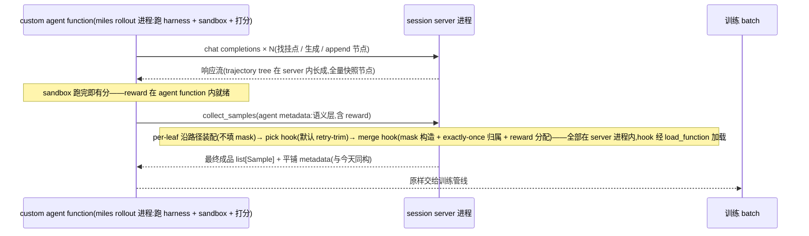

# Session Server Trajectory Tree 设计:always-branch serving + merge 期策略(v5)

状态:v5.1(2026-07-23,第二轮独立评审 verdict accept-with-changes——方向与删除收益确认成立;九项修订中 F1/F2/F4-F10 已按处方并入本文「v5.1 评审修订」节,F3 待需求方裁决)。v5 方向性重构(同日,需求方裁定)。serving 侧收敛为唯一行为——在树上找挂点、永不破坏、永不因失配拒绝;retry 降级为装配期 filter 的特例;loss mask 构造后移至 merge 阶段并开放用户自定义;分叉 best-effort 继承已匹配前缀的 token。v4 的两轴参数化(步数上限 × 超限行为)整体被取代:三个旧档位与 hybrid 角的差异全部移出 serving 层。历史版本(v2 linear/auto 双轴、v3 三值 enum、v4 两轴 + 独立评审六项修订)全文保存在 `backup/session-design-docs` 分支,本文不再复述。

v5 需求方输入(逐条,本文的推导起点):

1. split 不做全量 retokenize:best-effort 继承能 match 上的 history token,只从最初 mismatch 的位置开始 retokenize。
2. 默认都是 split(推导后收敛为:serving 只有 split 一种行为,见裁决 A)。
3. loss mask 的构造放到最后 merge sample 时才做,因为用户可能有自定义 merge sample function;该 function 需要能接收 get_session 的 session metadata 与 reward,以便把 reward 分配给每个 segment。
4. retry 是 filter 里的一个特殊 case:trim 掉树上所有分叉深度为 1 的(被放弃的)sample。
5. 方向探询:直接写成树(每个 assistant message 的结束是一个节点,在树上匹配)是否更好——本文裁决:是,树原生(裁决 B),侵入 `linear_trajectory` 的代价与被删除的机制大致相抵。
6. 树的存储先不做增量(子节点存父节点的 delta),v1 每个节点全量存 token info,保证设计在全量存储下成立;增量是后续优化,不是本轮目标。
7. break branch(新枝 delta)里出现 client 提供的 assistant 是正当形态(compaction 就会塞 assistant),一律按 prompt 处理;因为我们永远不 cut think,带着 assistant 去 apply chat template 没有 reasoning 丢失问题。
8. 节点定义修正:**一次模型生成的结束作为节点**——不是"每个 assistant message 一个节点"。client 提供的 assistant 不构成节点,只是节点 delta 里的 prompt 段。

## 动机

v3/v4 把"请求与存储历史失配"当作需要 serving 期裁决的三难(报错/破坏性重试/开新线),于是需要模式轴、步数上限、字节保真锚点、seed 占位、epoch 门卫。v5 的观察:这三难是**装配期问题被错误地前置到了 serving 期**。失配请求本身只有一个物理事实——它和已存历史共享一段前缀;serving 唯一必须做的是把它挂到共享前缀的末端继续生成。"被放弃的 turn 要不要训练"(retry vs fork 之争)、"token 归谁的 loss 区"、"reward 怎么分",全部是拿到完整树和 reward 之后才有信息量的决策,应该由装配期的 filter/merge 层——而且是可被用户替换的层——来做。serving 层去掉全部政策后,数据结构自然坍缩为树:节点=一次模型生成,分叉=兄弟节点,继承=共享路径。

## 裁决(v5 核心)

- **裁决 A:serving 永不破坏、永不因失配拒绝(always-branch)**。rollback 机制整体退役:`apply_rollback`、步数上限、超限行为轴、v4 的两个 arg 都不再存在。派生地,**seed 占位与 Phase 3 门卫(num_assistant/epoch)一并消失**——它们是"多个请求竞争同一条可变线"这一表示的补丁;树的提交是 append-only 的创建新节点,并发提交天然成为兄弟节点,没有可竞争的可变体。
- **裁决 B:树原生数据模型,v1 全量存储(需求方输入 6)**。session = forest(零重叠请求开新根)。**节点 = 一次模型生成的结束(需求方输入 8)**:`delta_messages` = 本次生成的请求相对父节点新增的消息(env 消息、client 携带的 foreign assistant)+ 本次采样的 assistant;token 存**全量快照** `token_ids`(根→本节点的完整序列,含继承的采样 id 与 canonical env/foreign 段)——与今天 `trajectory_token_ids` 的 checkpoint 语义同构,每节点即一份可直接注入/装配的完整前缀。一次成功提交恰好创建一个节点,`SessionRecord` 与节点 1:1。内存 O(节点数 × 路径长),与今天 per-line checkpoint 列表同阶;增量(delta)存储列为后续优化非目标。
- **裁决 C:token 继承 best-effort**。挂点 = 匹配路径的最深完整节点;新枝直接以挂点的全量快照起步(采样 id 原样,全量存储下继承 = 一次列表拷贝),仅对 suffix(从首个 mismatch 消息起)canonical retokenize 后追加。节点粒度继承与消息粒度继承 token 等价:采样 token 天然对齐 assistant(节点)边界,env 消息无论继承还是重渲染都是同一 canonical 结果,所以"只 retokenize 首个 mismatch 起"在节点粒度上无保真损失。`message_matches` 的文本相等保证继承合法(TITO 不变量按路径成立);v3"零继承更正确"的论据被反转:留在原采样流上恰是 TITO 的哲学,且 mismatch 的部分本来就不被继承。
- **裁决 D:foreign assistant = delta 里的 prompt 段,恒许可(需求方输入 7+8)**。client 提供的 assistant——few-shot 首请求、compaction 塞进 break branch 的历史——**不构成节点**,作为所属节点 delta 中的 prompt 段处理:canonical retokenize、loss 恒 0。**不经 `--tito-allowed-append-roles` 门控**(该 arg 保留,仅继续管非 assistant 的环境角色):break branch 携带 assistant 是正当形态,compaction 是典型生产者;前提是我们永远不 cut think,所以带 assistant 过 apply chat template 无 reasoning 丢失问题(v3 零继承的模板顾虑就此消解)。`prompt_assistant_count` 机制被结构性吸收(节点边界只由模型生成定义,client 材料不可能被误当 checkpoint);mid-path 外来 assistant(v4 评审记录的存量边缘)同样被统一。
- **裁决 E:装配分层**。server 侧:per-leaf 产原料 sample(路径 token 拼接 + 现有 compute/truncate 校验,保 TITO 校验在 server)+ **树结构 metadata**(节点表:parent、在各 leaf 中的 token span、foreign、truncated、提交时间戳;leaf 表:路径、创建序)。**merge 只有一种方向:沿根→leaf 路径自上而下折叠**(两条分歧路径的 token 不可拼接,折叠原语的前缀断言即其体现);server 沿路径把 per-node 原料机械装配成 per-leaf sample——logprobs/replay payload 的路径拼接是 TITO 簿记不是政策——但**不填 loss mask**。唯一真正跨 leaf 的东西是 mask 的 exactly-once **归属决策**(共享节点的 completion 算进哪条 leaf),它属于 merge hook。**caller metadata 通道(需求方 2026-07-23)**:`collect_samples` 新增调用方 metadata 入参——custom agent function 结束时把只有 harness 才知道的语义信息(哪条分支是哪个 subagent、任务标签、compaction 位置,以及 sandbox 跑完即有的 reward)返回给 miles,miles 传进 `collect_samples`;server 将其与自己的结构层合并进 `session_metadata`(两层独立命名空间,如 `{"tree": …, "agent": …}`,server 对语义层不透明透传、hook 可读)。pick/merge 两个 hook 在 **session server 进程内**消费 (leaf_samples, 双层 session_metadata) 产最终训练 sample——结构层给形状,语义层给含义与 reward;miles 侧只管调用 `collect_samples` 并原样收成品(CPU-heavy 装配不回流训练侧)。
- **裁决 F:retry = pick-samples hook 的默认实现(需求方 2026-07-23 细化)**。sample 挑选是**可定制函数**,retry-trim 只是它的默认实现。默认判据——leaf L 被 trim 当且仅当同时满足三条:(1) L 的路径**不是本 session 最长的 sample**(token 长度计,并列不 trim——并列即 twin/n>1 采样);(2) L 的节点**没有子节点**;(3) L 的父节点存在**比 L 更晚提交的其他儿子**(L 被取代;依赖节点 `committed_at` 时间戳,来源于 lock 内提交序,天然单调)。三条件的组合刚好把非 main-trajectory 的重试噪声全部排除而不误伤:链式重试 A2(t1)/A2'(t2)/A2''(t3 续走)中 A2、A2' 都命中(存在更晚兄弟)、存活枝不命中;深弃枝(A2→A3→A4 后在 A1 处换线)的 leaf A4 因其**自己的父节点** A3 没有更晚儿子而免疫——trim 只在"被直接取代的挂点"处发生,subagent/compaction 形态自然保留。reward 由 agent function 在生成过程中算好、随语义层进入 metadata(picker 因此可 reward-aware);reward 的最终分配在 merge。
- **裁决 G:截断只封"穿过该节点的延伸"**。延伸已截断节点 → 409(`TruncatedSegmentError` 沿用);在截断节点**之前**分叉、或在其文本内分歧(挂到 parent)照常。节点总数上限 `MAX_NODES = 1024`(需求方 2026-07-23;兜底跑飞,原 `MAX_SEGMENTS` 的树版,硬编码、有真实需求再提 knob)。

## 约束变化(相对 v3/v4)

- **撤除字节保真约束(需求方知情裁定,v5 最大的公开行为变更)**:rollback 的两种 400 文案、破坏性重试、`--session-rollback-mode`/v4 两 arg 从 serving 面整体消失;任何失配请求一律 200 + 分枝。旧行为的**训练数据语义**由默认 filter/merge 管线近似复刻(1 步重试的弃 turn 默认被 trim 不进训练;深分叉出多 sample)。M2 的 TestRollbackPins 从"保真 oracle"降级为 v3 历史的 characterization,树落地时退役、由树匹配矩阵的 HTTP pin 取代。
- 保留:单 session URL(约束 2)、OpenAI 方言/挂点只能从 messages 推断(约束 3)、TITO 不变量按路径成立(约束 4)、匹配串行生成并行(约束 7,session lock 内找挂点与建节点,Phase 2 无锁)。
- **训练恰好一次(原约束 5)移交默认 merge 管线**:每个采样节点的 completion 恰好出现在一个最终 sample 的 loss 区(默认:归属创建序最早的 leaf,其余 leaf 中 mask 掉);server 不再是这条不变量的执行者,自定义 merge 的用户自行负责(文档写明)。

## Serving 案例矩阵(找挂点的全部形状)

匹配算法:对每个根做路径匹配——cursor 逐消息推进,节点内逐 delta 消息比对(`message_matches`),**完整吞下一个节点才能进入其子节点**;分歧或请求吃尽即停,挂点 = 最后一个被完整匹配的节点(根前缀零匹配则该根不候选);多根取最深匹配;并列(twin)取最近提交。挂点确定后,请求剩余 suffix = 新枝的 delta。

| # | 请求形状(相对树) | 处置 |
| --- | --- | --- |
| 1 | 严格延伸某 leaf 路径,suffix 非空 | 挂点 = 该 leaf,生成后新节点成为其独子 |
| 2 | 恰等于某节点 N 的路径(degenerate,suffix 空) | 在 N 下生成新子节点(今天的退化延伸语义;N 已有子时即 retry 形状,新子为兄弟) |
| 3 | 匹配到内部节点 N 后 suffix 分歧(经典分叉/重试) | 新枝挂 N,与既有子为兄弟 |
| 4 | 分歧发生在某节点 delta 的 env 消息内 | 挂点 = 该节点的 parent,suffix 从分歧 env 消息起 |
| 4b | 分歧(或纯前缀重发)落在**根节点 delta 内**(无任何完整匹配节点;含"重发 `[U1]` 对已存 `[U1,a1]`"——今天的 no-anchor 400 形状) | 开新根,200(v5.1/F4 补行;两根互为前缀成为常态,strict 开关是 fail-loud 替代) |
| 5 | 分歧发生在某节点的 assistant 文本(client 改写/压缩了历史回复,compaction 形态) | 同 4 挂 parent;suffix 中的 assistant 一律成为 foreign 节点(prompt,loss 0),恒许可(裁决 D),200 |
| 6 | 零重叠(subagent 自带 system prompt) | 新根(forest);首请求整个 prompt 段(env + few-shot assistant)落在根下首个节点的 delta 里,该节点以首次采样的 assistant 收尾 |
| 7 | 延伸已截断节点(挂点 = 截断节点) | 409 `TruncatedSegmentError`(裁决 G) |
| 8 | 在截断节点的文本内分歧 | 挂 parent 照常分叉(截断只封穿过) |
| 9 | 并发:两个相同请求同时在飞 | 两次提交 = twin 兄弟节点(合法,等价于该挂点的 n=2 采样;filter/merge 期再裁) |
| 10 | 并发:sibling subagent 首请求同时在飞 | 各自挂各自的挂点/各开根,append-only 提交无竞争,无占位、无门卫 |
| 11 | 提交时挂点已多出新兄弟(Phase 2 期间树生长) | 无影响:提交创建自己的节点,不覆写任何东西(v3 C2 与 v4 评审 F4 的问题域消失) |
| 12 | `MAX_NODES` 超限 | 400,文案可辨识(harness 跑飞兜底) |
| 13 | 生成失败(后端非 200) | 透传、不建节点、树不变;随后任意新请求照常(v4 评审 F2 的 pin 形状,树下天然成立,该 pin 保留) |
| 14 | DELETE / closing | 语义不变:取 session lock,closing 复查覆盖全树 |

## v5.1 评审修订(2026-07-23,第二轮独立评审九项,F3 除外均已定)

- **F1 samples wire 契约修订(N3 前置)**:现行 `COMPUTED_FIELDS` allowlist(`samples/codec.py`)不含 `reward` 与 `metadata`,server 内 hook 的产出会在 decode overlay 时被静默丢弃。修订:`reward` 与 per-sample `metadata` 加入 allowlist;**server 输出权威**——`agentic_tool_call.py` 现行的 driver 侧 `agent_metadata` 逐 sample 合并与 `session_metadata` 落 `samples[-1]` 在 session 路径上退役(server 已持有语义层,双写必致覆盖或重复),该文件与其 golden test 入 N4 锚点。
- **F2 分支↔leaf 对齐键(定案)**:结构层 node 表携带每个节点的 **OpenAI response id**(record 里现成,agent 在每轮响应里看到同一 id,零新增 wire 面);语义层约定:per-branch reward/标签**按 response id 键控**。hook 由 id join 语义层与结构层,twin/并发 sibling 均无歧义。
- **F4 匹配完备性**:案例矩阵补 4b 行(根 delta 内分歧/纯前缀重发 → 开新根;今天最常见的 harness bug 从 400 变静默新根,strict 开关是 fail-loud 替代,写入 release note);**虚拟森林根**:兄弟根在 picker 判定中互为兄弟(否则根级重试永不被 trim);twin 下降歧义:找挂点是对 (深度, 提交序) 的全候选搜索,并列取最近提交——单游标描述不完备,以此为准。
- **F5-spike 实证结论(2026-07-23,per-family 模板实验,N1 入口门)**:"永不 cut think"前提在**保 think kwargs surface** 上对 10/11 family 成立(qwen3/qwen35/qwennext/glm47/nemotron3/kimi25/kimi26/minimax_m25/m27/deepseekv4,其中 9 个 token 级实证;mid-path 渲染 == final-position 渲染、前缀性、gen-prompt 前缀均逐字节 PASS);但**默认 `{tool}` surface 的注册行普遍不带保 think kwarg**,裁决 D 的 compaction delta 会踩中剥 think——修法已实证:把保 think kwarg 无条件提升进 `{tool}` 行(family 常量而非 surface 变量),纯 tool-loop 历史渲染逐字节零差异(全 jinja family PASS;deepseekv4 同时落 `drop_thinking=False`,顺带修掉其无 tools 时连纯 tool-loop 都剥 think 的既有陷阱)——该注册表修订入 N2a 范围,且"前提由 miles pin 的模板/kwargs 唯一承载"须由针对 `SUPPORTED_TEMPLATES` 注册表的测试钉住。**deepseekv32 结构性缺口已裁决取 (a)**(实施方按最小方案定,2026-07-23):v32 上对"assistant 之后还有 user"形状的 delta fail-loud 拒绝(不 fork sglang、不静默剥 think);落点在 N2b 的后缀分词路径,文案可辨识。备选 (b) patch sglang 加 `drop_thinking`(dsv4 先例)留作 v32 用户出现真实 compaction 需求时的升级路径。附加风险已记:qwen3/35 与 GLM 对 reasoning 做 strip/trim 归一化(client 回放字节可能微差,`message_matches` 按原值比对);GLM 空 reasoning 渲染裸 `</think>` 与生成期形状不同(loss-0 段,无害但非逐字节)。
- **F5 TITO assistant 后缀分词 = 显式工程量**:今天 `_split_appended_segments`/`tokenize_additional_non_assistant` 在两层硬拒 assistant 段,segment 分词用合成 dummy 上下文,边界修正按 family 子类各管(Qwen3 `<|im_end|>`+newline 等)。修订:新增"真实路径上下文的后缀分词"原语承载 assistant 段;role assert 移出 tokenizer、归 strict 判定;per-family 固定模板 spike(mid-path assistant 渲染保留 reasoning 与边界 token)为 **N1 入口证据门**。
- **F6 server 内 hook 执行契约**:(a) 仅接受 sync callable,async 在 load 时拒绝;(b) hook 异常一律捕获映射 422、body 携带 hook 身份(用户政策 bug 不得伪装成 server 死亡;今天仅 Assertion/ValueError→422,其余 500);(c) hook 在事件循环上同步执行,长 CPU 会停摆该实例全部 session——**知情接受**并写入 arg help;(d) pick 纯度用同一性校验强制(返回集必须是入参对象子集);(e) 生产仅支持 import-path 加载(`function_registry` 是进程本地的,spawn 出的 session server 进程看不到 driver 注册,仅限进程内测试);(f) 语义层缺失(agent function 抛错后 `collect_samples` 仍会被调)时默认 merge 的 reward 缺省语义:reward=None 原样透传,不造默认值。
- **F7 截断机制归属**:`TruncatedSegmentError`/409 与节点 `truncated` 标记是**引入**而非沿用(本分支不存在),落 N2b。
- **F8 序号与折叠语义**:节点排序键 = per-session 逻辑提交序号 `seq`(lock 内单调递增),`committed_at`(墙钟)仅装饰——picker/tie-break 一律用 `seq`;默认 merge 沿用折叠原语的 early-stop(non-COMPLETED / replay-gap 处停折),exactly-once 台账只记**实际折入**的 span(结构层 node 表与成品 token 跨度可能因 early-stop 不一致,以台账为准);reward 赋值在折叠**之后**(折叠原语对 reward 做相等断言,折前逐 turn 赋值必炸);`MAX_NODES` 权威检查在 Phase 3(Phase 1 检查仅 fast-fail,并发下允许轻微过冲)。
- **F9 N2 拆分**:见里程碑 N2a/N2b。
- **F10 简化收编**:foreign 段区间装配期 derive 不落存储;`get_session` 树 dump 首版 = records + node 表,不新造 response model(调试面 schema 后置)。
- **F3(已裁决,需求方 2026-07-23)**:默认 picker 判据改为**时序取代 + 长度护栏**。(a) trim 判定只看时序:childless ∧ 存在 `seq` 更晚的兄弟(虚拟森林根下根级同理),长度不参与判定——"默认只允许 retry"的形态假设下,mainstream 必然时序更靠后,时序是理论上充分的判别器;(b) **hard assert 护栏**:每个被 trim 的 leaf 断言其成品长度 ≤ 存活枝最长 leaf 的成品长度,违反即 422(body 携带 picker 身份与两个 leaf 的 response id)——被弃者比 mainstream 还长意味着树不是 retry 形态,默认 picker 拒绝装懂,fail-loud 提示换自定义 picker。后果如实记录:与"逐字复刻今天"存在一处知情偏差——今天"末轮重试且被弃更长"被破坏性销毁、静默成功出 1 个 sample,默认 picker 下同形状 422(写入 release note 与 arg help);twin n=2 的较早者被 trim(较短)或触发 422(较长),默认 picker 不支持刻意 n>1 采样,自定义 picker 承接(irreducible,已记)。N4 验收标准恢复生效,"复刻旧训练语义"claim 措辞收窄为"护栏内确定性复刻"。

## 数据流(v5 全景)

要点:①树只在 server 侧生长;②sandbox 执行与打分全部封装在 custom agent function 内,进入 `collect_samples` 时 reward 已在语义层就绪,管线里没有独立 RM stage;③**miles 侧只管调 `collect_samples`**,一切 CPU-heavy 装配(折叠、mask)与两个政策 hook 都在 session server 进程内执行(#1759 的下沉哲学延续:records/token 不离开 server;被 trim 的 leaf 连 wire 都不过);④pick 先于 merge 是硬约定(存活集归属 + 噪声成本止步 serving);⑤返回形状与今天同构(n 个成品 sample + 平铺 metadata),下游零适配。

## 数据面与 filter/merge 层

**collect_samples(server)**:每个 leaf 产一个原料 Sample——全量存储下 token 即 leaf 节点的快照本身(无需拼接),per-leaf 跑现有 compute → truncate(R3 payload 提取、`max_trim_tokens`、截断裁剪都按路径成立);`session_metadata` 双层:语义层 = 调用方(agent function)经 `collect_samples` 入参传入的不透明 blob;结构层携带树结构:`nodes[{id, parent, truncated, seq, committed_at, completion_span, response_id}]`(completion_span = 本节点采样 completion 在快照中的区间;foreign 段区间不落存储、装配期由 `delta_messages` + 分词现derive——评审 F10b,少一份要维护一致性的状态;`seq` = per-session 逻辑提交序号,`response_id` 见 v5.1/F2)+ `leaves[{path_node_ids, created_order}]`,leaf 序与 samples 序对齐。**沿路径装配到位、唯独不填 loss mask**(每个原料 sample 附 per-node completion span,mask 材料齐全;不存在任何跨 leaf 的 token 操作)。`get_session`:树 dump(节点 + records + 结构),白盒调试面。

**server 侧装配管线**(`collect_samples` 内顺次执行;两个 hook 由 session server 进程经 `load_function` 加载,默认实现复刻今天的训练语义)。前提:**reward 已就绪**——sandbox 执行与打分全部封装在 custom agent function 内(它掌握任务结局,跑完即有分),reward 随语义层经 `collect_samples` 入参进入 server;管线里没有独立的 RM stage。

1. **per-leaf 装配(非政策,不可定制)**:沿每条 leaf 路径跑现有 compute → truncate,产原料 sample(logprobs/replay payload 的路径拼接是 TITO 簿记),唯独不填 loss mask。
2. **pick-samples hook(裁决 F,可定制)**:`pick_fn(leaf_samples, session_metadata) -> list[Sample]`,arg 如 `--session-sample-picker-path`;纯挑选契约——可丢弃/重排、不得改写 token 内容;语义层里有 reward,picker 可以 reward-aware。默认实现 = 裁决 F 的三条件 retry-trim。被 trim 的 leaf **完全不进入后续任何环节**(不参与 mask 归属、不折叠、不过 wire、不进训练)——always-branch 造出的噪声分枝,其成本被限定在 serving 期的那一次生成。为了让挑选不依赖列表位置,**每个原料 sample 的 metadata 自带本 leaf 描述子**(节点 id 路径、parent、committed_at、路径 token 长度、是否有子),树表随行——自定义可做任意策略(全保留做 tree-RL、按分支宽度采样、只留最长 top-k、按 reward 阈值等)。
3. **merge hook(可定制)**:`merge_fn(leaf_samples, session_metadata) -> list[Sample]`(reward 在语义层内),arg 如 `--session-merge-function-path`。默认实现复用现有折叠原语 `merge_samples`/`_merge_sample_pair`(`generate_utils/sample_utils.py`,今天 loss mask 的唯一构造点):沿每条存活 leaf 的路径折叠 per-node sample,节点 loss 归属创建序最早的**存活** leaf(exactly-once;**pick 先于 merge 是硬约定**——归属必须算在存活集合上,否则共享节点的最早 leaf 被 trim 时其 completion 会无声地从训练数据消失),foreign/env 段 loss 0,reward 按语义层分配随 leaf;自定义空间:按 reward 重新分配共享节点的 mask 归属、跨枝广播 advantage(对各 sample 的数值操作,非 token 合并)等。实现落点:`core.py` collect_samples 里今天硬编码的 `samples = [merge_samples(...)]` 一行被 hook 调度取代,位置不动、变成可换。
4. 平铺键天然兼容:server 返回的成品 sample 与今天同构(平铺 `tito_session_mismatch`、`accumulated_token_ids`),`ray/rollout/metrics.py` 与 `session_verify_agent` 零修改、无需映射层。

## 状态模型与实现落点

`TrajectoryNode`(新):`delta_messages`、全量快照 `token_ids`、`completion_span`/`foreign_spans`、`finish_reason`、`record`(1:1)、`parent`/`children`、`committed_at`。`SessionTree`(替代 `SessionState.segments: list[LinearTrajectory]`):roots 列表 + 找挂点算法;`lock`/`closing` 留在 session 级(M1 的 `SessionState` 骨架沿用)。`LinearTrajectory` 退役,其职责三分:匹配 → 树的找挂点(`message_matches` 与 M3′ 的纯判定思路直接演化);token 追踪 → per-node delta + 路径拼接(prefix 校验 = 注入 input_ids vs 路径拼接 + suffix);装配 → per-leaf compute(现有流水线按路径喂)。`chat_completions` 三段式不变:Phase 1 锁内找挂点 + 预分词注入;Phase 2 无锁 proxy;Phase 3 锁内 append 节点(无门卫)。

现有分支基线的处置:`feat/session-rollback-mode` 现停在 M1+M2′(`279bc9484d`)+ M3′(`d5e94bc610`)。**M1 的 `SessionState` 与 M3′ 的判定/变更拆分、few-shot 修复、failed-first-turn pin 全部是树的垫脚石,保留**;M2 的 rollback pins 在树落地的里程碑退役(设计裁定的公开行为变更,非回归);M4′ 的 WIP stash 丢弃;v4 两 arg 从未存在于任何 commit,自然不做;`v3-impl-backup` 分支保留 v3 全量实现供比对。

## 里程碑(v5,待冻结后评审)

1. **N1 树数据模型 + 找挂点(纯增,不接线)**:`TrajectoryNode`/`SessionTree`、案例矩阵 1-12 的纯单测(含 twin 并列、foreign assistant delta、截断);不触碰 serving 路径。
2. **N2a serving 切换·行为保持半程(评审 F9)**:树数据模型接线进 serving(Phase 1 找挂点 + 继承注入,Phase 3 append 节点),但挂上**单链守卫**复现今天全部可观测行为——M2′ rollback pins 逐字节零修改全绿;`LinearTrajectory` 退役。该守卫不是脚手架,它几乎逐字就是 `--session-strict-append-only` 的实现(冻结交付物提前落地)。含 F5 的 TITO 扩展:assistant-bearing 后缀的 canonical 分词(真实上下文后缀分词原语;role assert 移出 tokenizer、归 strict 判定),前置 per-family 模板 spike 为 N1 入口证据门(固定模板渲染 mid-path assistant 须保留 reasoning 与边界 token)。
3. **N2b serving 切换·政策翻转(公开行为变更点,自包含小 diff)**:默认从单链守卫切到 always-branch;M2′ rollback pins 退役 ↔ 树匹配矩阵 HTTP pin 落地在**同一个 diff** 里逐条对照;引入节点 `truncated` 标记与 `TruncatedSegmentError → 409`(评审 F7:是"引入"非"沿用",本分支 errors.py 尚无此类;`TRUNCATION_HANDLING_DESIGN.md` 的替代方向在此正式化);`MAX_NODES = 1024`(权威检查在 Phase 3,评审 F8)。
4. **N3 数据面**:per-leaf 原料 sample + 树 metadata;`get_session` 树 dump;S1/S2/R3/截断的 per-leaf 语义测试。
5. **N4 pick/merge 层(server 内)**:两个 hook 在 `collect_samples` 内接线(load_function 挂载、纯挑选契约、per-sample leaf 描述子、caller metadata 入参)+ 默认 retry-trim 实现(三条件判据测试:链式重试、深弃枝免疫、twin 并列不 trim、根级重试)+ 默认 merge(exactly-once 归属存活集 + 平铺键同构输出);`session_verify` 与 metrics 在默认管线下零修改全绿。
6. **N5 e2e 与收尾**:`session_verify_runner` 树变体(需 GPU CI,uncovered delta 沿旧记录);`MAX_NODES`/日志/WARN 打磨。

## Roadmap

**近期(2026-07-23 全部裁决闭合,冻结完成)**:
1. 已钉死的全部决策:always-branch 树 + 全量快照节点(生成结束即节点)+ foreign assistant 恒许可;`--session-strict-append-only`(默认关,单链不变量守卫);picker 三条件默认 retry-trim;pick → merge 于 **session server 进程内** `collect_samples` 原位执行,`load_function` 挂载;caller metadata 通道(语义层含 reward,sandbox 在 agent function 内跑完即有分);`MAX_NODES = 1024`。
2. 独立评审一轮(refactor-heavy 纪律,重点:N2 公开行为变更面、树匹配矩阵完备性、两 hook 接口契约、per-node span 元数据、`collect_samples` 入参兼容)。
3. 实施基座(策略由实施方定,需求方已授权):**保留** M1+M2′(SessionState + 旧行为 pins + failed-first-turn pin)与 M3′(判定纯函数化 + few-shot 修复)作垫脚石 commit——M2 旧 pins 留在历史里使 N2 的 diff 逐条展示"旧 pin 删除 ↔ 树矩阵 pin 新增",公开行为变更 review 一目了然;**丢弃** v4 的 M4′ WIP stash;N1-N5 以新 commit 叠加,语义上属早期 commit 的修正按既有纪律烙回原 commit;`v3-impl-backup` 保留供 N2 对照。
4. N1 → N5 依序落地,每级全绿后进下一级。

**中期(依赖外部条件)**:
- GPU e2e:`session_verify_runner` 树变体(4×H200 CI,本地不可跑)——树匹配、pick/merge 默认管线的端到端验证;默认配置必须绿。
- 发布路径:上游 #1751/#1762/#1758-#1760 落地后 rebase,PR 化(或作为 stack 的后续节);v5 的公开行为变更(rollback 400 家族消失)需 release note 显著标注,`--session-strict-append-only` 作为迁移期排错工具一并交付。

**远期(明确不在本轮)**:
- 节点增量(delta)存储(需求方输入 6 的后续优化;全量快照的内存与今天同阶,先跑通再省)。
- tree-RL 用法沉淀:自定义 picker/merge 的示例库(全保留、按分支宽度采样、reward 广播),视用户需求成文。
- Anthropic 方言 adapter(独立设计轮,沿 v3 非目标)。
- per-session 覆写与 rollout 级 token 总预算(沿 v3 开放问题)。

## 风险与开放问题

- **公开行为变更**(撤保真):依赖 rollback 400 做 harness 排错的部署失去 fail-loud;树日志(分枝 INFO、深分叉 WARN)是替代观测面。缓解:strict 开关(下条,需求方已倾向保留)。
- **strict 开关(开放问题 1 已定案:保留、默认关)**:定义 = **"树永远是一条链"的不变量守卫**。接受四类:空树首请求(few-shot prompt assistant 照常)、严格延伸唯一 leaf、退化重发(请求==到 leaf 的完整路径,leaf 下生成独子)、失败生成后的任意新首请求(failed-first-turn pin 在 strict 下同样成立)。拒绝三类(400 + 诊断:匹配到的节点与首个失配消息序号):会开第二条根的、会产生兄弟节点的(挂 internal 节点/退化重发到已有子节点,即一切 retry/分叉形状)、延伸 suffix 携带 client assistant 的(strict 下回归 `--tito-allowed-append-roles` 门控,默认拒——白盒模式要抓的正是"主链上出现模型没生成过的 assistant";普通模式的 foreign 恒许可服务于分枝,strict 不许分枝故不适用)。不变:延伸已截断 leaf 仍 409。该定义恰好复刻 v3 disabled 档的全部可观测行为(文案换树词汇、诊断更详),实现为找挂点出口的单一判定。arg 名已定:`--session-strict-append-only`(需求方 2026-07-23)。
- **sample 数与打分成本**:每 leaf 一原料 sample,重试风暴下 leaf 膨胀;打分封装在 agent function 内、成本形状由用户掌控(可只对关心的枝打分);默认 picker 止血的是 merge 与训练侧的噪声,`MAX_NODES` 兜底。开放问题 2 已定案(裁决 F 三条件,需求方 2026-07-23)。
- **自定义 pick/merge 的挂载点**——**开放问题 3 已定案(需求方修正)**:机制 = `load_function` 路径 arg(`custom_agent_function_path` 先例);执行位置 = **session server 进程内** `collect_samples` 中(今天硬编码 merge 行的原位),不在 miles rollout 侧——miles 只管调 collect_samples,CPU-heavy 装配全部留在 server。约束随记:hook 函数须可被 session server 进程 import(args 本就流到 server,同 codebase 成立)。
- **exactly-once 与 reward 归属的张力**:默认"最早 leaf 训练共享前缀",但共享前缀的 reward 来自该 leaf 的 outcome——分叉后其他枝的高 reward 不回流。这正是开放给自定义 merge 的空间,默认不做聪明事。
- **twin 歧义**(并列匹配取最近提交)沿 v3 记录;树下 twin 是合法兄弟,歧义只影响挂点选择的确定性。
- **radix cache**:继承提高 KV 前缀命中(v3 零继承的已接受代价被收回)。
- **树 dump 体积**:`MAX_NODES = 1024` 已定(开放问题 4 闭合);`get_session` 全树 dump 在大树下的响应体积留意实测,必要时后续加分页/裁剪参数。
- **侵入性**:`linear_trajectory.py` 重写为树是本设计最大 diff;对冲是删除量(rollback 全家、seed、门卫、prompt_assistant_count)与并发模型的实质简化。N2 是不可回避的大里程碑,需要独立评审一轮后再实施。
